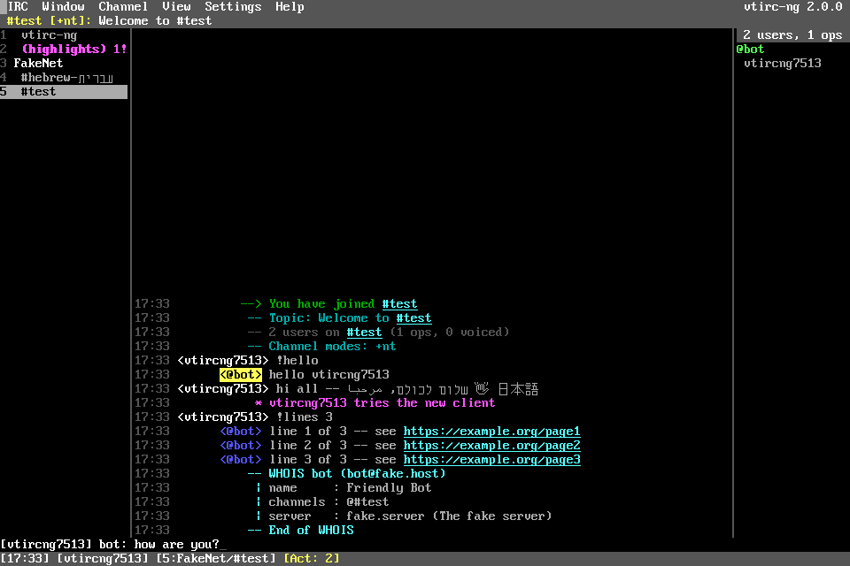

# vtirc-ng

A full-featured IRC client for the text screen, written in FreeBASIC on
[libvt](https://github.com/rbreitinger/libvt). It runs on **Windows (32-bit)** and **Linux (64-bit)** as a
single executable, and handles several networks at once, TLS, SASL, services, DCC and
Unicode text, including right-to-left Hebrew and Arabic.

vtirc-ng grew out of [VTIRC 1.x](https://github.com/rbreitinger/vtirc) by Rene Breitinger, which is kept as it
was for preservation.



---

## Features

**Networks and connections**
- Several networks at the same time, each with its own list of servers (tried in turn), nick, alternative nicks,
  user name, real name, autojoin channels (with keys) and commands to run after connecting
- Network list dialog with preset networks (Libera.Chat, OFTC, EFnet, IRCnet, Rizon, DALnet, QuakeNet,
  Undernet, and a local / I2P entry)
- TLS with certificate pinning: the first certificate a server shows is remembered, and a changed
  certificate stops the connection until you confirm it with `/cert accept`
- SASL PLAIN login, NickServ identification, or a server password
- IPv4 and IPv6; SOCKS5 proxies (with remote DNS, so it works with Tor) and HTTP CONNECT proxies
- Connecting runs in the background, so the window never freezes. Lost connections reconnect with
  increasing delays, then rejoin their channels in the same windows
- Ping-timeout detection and a lag meter
- IRCv3: `server-time`, `echo-message`, `multi-prefix`, `away-notify`, `account-notify`, `extended-join`,
  `chghost`, `userhost-in-names`, `batch` (bouncer playback), `cap-notify`, `invite-notify`, `setname`
- Flood protection (a burst of lines, then a steady rate) and automatic splitting of long messages, never
  cutting a character in half
- Text that isn't valid UTF-8 is read in a legacy code page (per network: cp1252, cp1255 Hebrew, cp1251,
  cp1253, cp1256)

**Chat window**
- A window tree grouped by network, with activity colours, unread counts and window numbers (Alt+1..0).
  Next to it, the chat and a nick list sorted by rank (`~ & @ % +`); away users are dimmed
- Unicode throughout: Hebrew and Arabic read right to left (Arabic letters join as they should),
  and Cyrillic, Greek, CJK and emoji all display. The glyphs come from GNU Unifont
- mIRC colours (all 99, plus hex colours) and bold, underline, italic, strikethrough and reverse
- Timestamps, a right-aligned nick column, nick colours, and a line marking where you stopped reading
- Links and `#channel` names are clickable
- The topic bar shows channel modes; the status bar shows the lag, away state and window activity (irssi style)
- Joins, parts and quits can be hidden completely, or only for users who haven't spoken recently
- Drag to select text; it is copied in reading order, so right-to-left text copies correctly
- A `(highlights)` window collects every mention from all networks
- Your nick and any extra highlight words trigger notifications: a sound, taskbar flashing, and desktop
  notifications on Linux. Each window can be set to notify on all messages, highlights only or nothing

**Commands and automation**
- 100 commands, including `/whois`, `/ns`, `/cs`, `/ms`, `/hs`, `/os`, `/bs`, `/op`, `/kb`, `/topic`,
  `/mode`, `/list` and `/dcc`. Commands vtirc-ng doesn't know are sent to the server as they are
- Tab completion of nicks (most recent speakers first), `#channels`, `/commands` and settings
- Aliases (`$1`, `$2-`, `$chan`, `$nick`, `$network`), triggers (run a command when something happens),
  perform lists (commands run after connecting)
- Ignore list with masks and types, a notify list (MONITOR/ISON), auto-away, `/lastlog` search, `/urls`
- DCC CHAT and DCC SEND/RECEIVE, including passive (reverse) DCC for users behind NAT and resuming
  interrupted downloads, with a transfers window
- Logs per network and channel, with the last lines replayed when a window opens
- Channel browser (F4) with a filter and sorting

---

## Getting started

1. Start vtirc-ng. On the first start the network list opens (**F2** opens it later).
2. Select a network and press **Connect**, or **Edit** it first to set your nick and login.
3. Or type a command in any window, for example `/server irc.libera.chat +6697`
   (a `+` before the port means TLS), then `/join #channel`.

Type `/help` for the command list, `/help <command>` for details, or press **F1** for the manual.

### Keys

| Keys | Action |
|---|---|
| Alt+1 … Alt+9, Alt+0 | window 1 … 10 |
| Alt+← / Alt+→, Ctrl+PgUp / Ctrl+PgDn, Ctrl+Tab | previous / next window |
| Alt+A | next window with activity |
| Ctrl+W | close the window (leaves the channel) |
| PgUp / PgDn, Shift+PgUp / Shift+PgDn, Ctrl+Home / Ctrl+End | scroll history |
| Up / Down | input history |
| Tab, Shift+Tab | complete nick / #channel / /command |
| Ctrl+B Ctrl+U Ctrl+I Ctrl+K Ctrl+R Ctrl+T Ctrl+O | bold, underline, italic, colour, reverse, strikethrough, reset |
| Shift+Ins, Ctrl+V, middle click | paste (several lines ask first) |
| Ctrl+F | search the window |
| F1 help, F2 networks, F3 preferences, F4 channel list, F7 tree, F8 nick list | |
| Ctrl+Q | quit |

**Mouse:** click a window in the tree to open it. Double-click a nick to open a private conversation.
Right-click a nick, a window or the chat for a menu. Click a link to open it.

---

## Configuration

Settings are saved automatically:

| System | Folder |
|---|---|
| Windows | `%APPDATA%\vtirc-ng` |
| Linux | `$XDG_CONFIG_HOME/vtirc-ng` (normally `~/.config/vtirc-ng`) |
| Portable | put an empty file named `portable` next to the program, and everything is kept in the program's folder |

`vtirc-ng.ini` has these sections (most can be edited in the program: F2, F3 and the Settings menu):

| Section | Contents |
|---|---|
| `[global]` | all preferences (`/set` lists them) |
| `[network <name>]` | `server=host/port/tls[/password]` (repeatable), nick, altnicks, login, autojoin, perform, charset … |
| `[ignore]` | `mask = types` (`msgs privs notices ctcps invites joins dcc all`) |
| `[alias]` | `name = command` |
| `[trigger]` | `item = event\|mask\|channel\|command` |
| `[highlight]`, `[friends]`, `[chanset]` | highlight words, notify list, per-window settings |
| `[theme]` | colour overrides, e.g. `bg = black`, `own = yellow`, `link = 11` |

Other files: `certs.ini` holds the pinned TLS certificates, `logs/<network>/` the logs, and `downloads/` the
received DCC files.

When vtirc-ng finds a VTIRC 1.x `.vtirc` file next to the program, it imports your server, nick, channels
and colour scheme on the first start.

### Security notes

- TLS certificates are pinned on first use rather than checked against certificate authorities.
  A changed certificate is reported and must be accepted with `/cert accept`.
- Passwords are stored in `vtirc-ng.ini` as plain text. On Linux the file is readable only by you.
- DCC offers are never accepted automatically unless you turn on `dcc_auto_accept`. Received files
  keep only their bare name, get a safe name if needed, and never overwrite an existing file.
- Only `http`, `https`, `ftp` and `irc` links can be opened from the chat.

---

## Building

You need **FreeBASIC 1.10.1** and **SDL2**. libvt is included in `vt/` (with vtirc-ng's extensions).

```sh
build/build.sh            # Linux 64-bit  -> build/out/linux64/vtirc-ng
build/build.sh win32      # Windows 32-bit (fbc32.exe under wine) -> build/out/win32/vtirc-ng.exe
build/build.sh all        # both
build/build.sh test       # unit tests
tests/run_net.sh          # network tests against tests/fakeircd.py
build/package.sh          # release archives in dist/
```

On Windows, run `build\build.bat`. It links against `deps\win32\SDL2.dll`, which must sit next to
`vtirc-ng.exe`. On Linux, install SDL2 (`libsdl2-dev`).

`fonts/vtirc-ng.vtuf` (the complete Unifont, including Chinese, Japanese and Korean) is optional. The most
common scripts are built into the program. Put the file in a `fonts` folder next to the program for full
coverage.

---

## License

vtirc-ng is released under the MIT license (see `LICENSE`).
libvt: MIT, Rene Breitinger (`vt/LICENSE-libvt`).
GNU Unifont glyphs: SIL Open Font License 1.1 (`fonts/UNIFONT-LICENSE.txt`).
